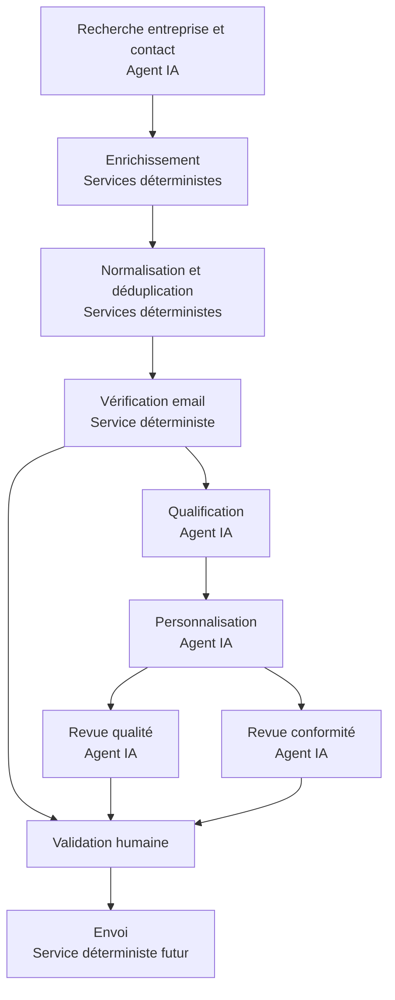
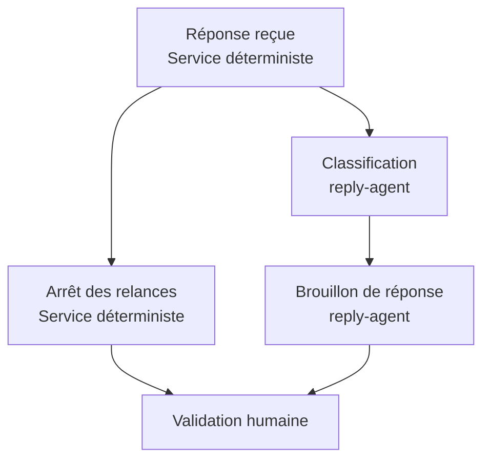

# Architecture opérationnelle des agents et workflows

## 1. Objectif

Cette architecture prépare l’automatisation commerciale sans transformer les
agents IA en services autonomes capables d’exécuter des effets externes.

Deux utilisateurs humains pilotent la plateforme :

- **Agency Owner** : crée l’agence et les clients, invite les Recruiters,
  configure les intégrations et contrôle les permissions ;
- **Recruiter** : recherche, qualifie et traite les prospects des clients qui
  lui sont affectés, puis valide les actions commerciales autorisées.

Les agents IA analysent, proposent et révisent. Les services déterministes
valident, persistent, dédupliquent, vérifient et, dans une phase ultérieure,
exécutent les effets externes approuvés.

## 2. Séparation des responsabilités

| Type | Responsabilité | Exemples | Effet externe autorisé seul |
| --- | --- | --- | --- |
| Humain | décider, approuver, corriger | Agency Owner, Recruiter | oui, via une action serveur autorisée |
| Orchestrateur | sélectionner un workflow versionné | planifier un run | non |
| Agent IA | analyser ou produire une proposition structurée | recherche, qualification, personnalisation, classification | non |
| Skill | appliquer une méthode commerciale réutilisable | StoryBrand, Made to Stick, 100M Offers | non |
| Service déterministe | exécuter une règle reproductible | normalisation, déduplication, vérification d’email | seulement si le workflow et les permissions l’autorisent |
| Adaptateur fournisseur | traduire un contrat interne vers une API | futur fournisseur d’enrichissement ou d’envoi | seulement derrière un service autorisé |

Un agent ne remplace donc pas un vérificateur d’email. La vérification d’email
est un service déterministe utilisant un fournisseur externe et retournant un
résultat normalisé.

## 3. Agents opérationnels préparés

Le catalogue actif est `.codex/agents/catalog.v2.json`.

| Agent | Capacités autorisées | Interdictions principales |
| --- | --- | --- |
| `lead-research-agent` | recherche d’entreprise et de contact | enrichir, vérifier ou contacter |
| `qualification-agent` | recommandation de qualification expliquée | modifier seul le statut final ou envoyer |
| `personalization-agent` | proposition de message personnalisé | inventer un fait, une preuve ou envoyer |
| `message-quality-agent` | revue de clarté et crédibilité | approuver juridiquement ou envoyer |
| `compliance-agent` | signalement des risques de conformité | garantir la conformité ou décider seul de l’envoi |
| `reply-agent` | classification et brouillon de réponse | envoyer une réponse |

Les agents stratégiques déjà présents restent disponibles pour l’onboarding, le
positionnement, les offres, l’ICP, la stratégie d’acquisition, la préparation
commerciale et l’analyse.

## 4. Workflow sortant

Le workflow versionné impose quatre dépendances avant l’envoi :

1. email vérifié ;
2. qualité du message révisée ;
3. conformité du message révisée ;
4. approbation humaine enregistrée.

La définition refuse un envoi qui ne déclare pas ces dépendances. La tâche
d’envoi elle-même devra les recharger et les revalider juste avant l’effet
externe.

## 5. Workflow de réponse entrante

Ce workflow ne contient volontairement aucun service d’envoi. La réponse
proposée reste un brouillon jusqu’à une validation humaine et une future action
serveur explicitement autorisée.

## 6. Sécurité multitenant

Les commandes exposées ne reçoivent que l’identifiant de la ressource métier et
une clé d’idempotence. Elles n’acceptent ni `agency_id`, ni `client_id`, ni
adresse email fournie par le navigateur.

Le serveur :

1. résout le tenant depuis la session active ;
2. vérifie la permission de l’acteur ;
3. recharge la ressource dans le tenant actif ;
4. compare son agence et son client au contexte résolu ;
5. réserve un run avec une clé d’idempotence stable ;
6. transmet à Trigger.dev uniquement l’identifiant opaque du run.

Une future tâche Trigger.dev devra recharger le run, son tenant, la ressource,
les permissions techniques et les garde-fous avant chaque étape.

## 7. Vérification d’email

Le port `EmailVerificationProvider` protège le domaine contre les contrats
spécifiques des fournisseurs. Le service :

- recharge l’email du contact côté serveur ;
- vérifie que le contact appartient au client actif ;
- normalise l’adresse ;
- réserve l’opération de manière idempotente ;
- appelle le fournisseur avec un contexte tenant vérifié ;
- valide la réponse structurée ;
- persiste le résultat normalisé ou un code d’échec sûr ;
- ne journalise jamais l’adresse email.

Aucun fournisseur réel n’est encore connecté. Ce choix appartient à la phase
d’enrichissement et de vérification du plan d’implémentation.

## 8. Sorties structurées des agents

Les schémas Zod opérationnels couvrent la recherche, la qualification, la
personnalisation, la revue de message et la classification des réponses.

Les affirmations doivent préciser leur classification, leur confiance et leurs
références. Les sorties de revue imposent une validation humaine. Une réponse
non conforme au schéma échoue ; elle n’est pas corrigée ou exécutée
silencieusement.

## 9. Éléments volontairement différés

Ce lot ne crée pas :

- de migration ou table distante ;
- de tâche Trigger.dev active pour l’envoi ;
- d’adaptateur vers un fournisseur réel ;
- d’appel payant ;
- d’envoi d’email ;
- d’interface métier supplémentaire ;
- d’autonomie permettant à un agent de lancer une campagne.

Les repositories définis sont des contrats. Leur implémentation Supabase, les
tables de runs, les tâches durables, les adaptateurs et les écrans
d’exploitation seront ajoutés dans les phases correspondantes des prompts 18 à
35.
